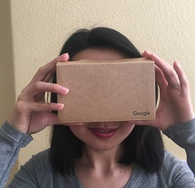

# puzzler
Puzzler is an iOS Google Cardboard app in which kids between 4th and 6th grades will solve puzzles by remembering a sequence of flashing five orbs. It was made with Unity.

Here is the final result:

Please click on the image link above to view the video.

### Persona

### Design Process
Base on [VR-Design_Puzzler](https://github.com/udacity/VR-Design_Puzzler/releases) from Udacity.

### Step 1 
Start with a gate because it is the easiest and simplest object that can be tested in VR viewer (Google Cardboard is used in this project)

Figure-1 Gate is used to test in Google Cardboard against a real world door.	

After a couple of tries, a reasonable scale values is as shown in figure-2

Figure-2 Transform value of the gate in Unity

### Step 2 
Design Start and Replay menus. 

Here are some sketches:

Figure-3 First sketch

Figure-4 Second sketch

Figure-5 Third sketch

Figure-3 is chosen because it looks simple for the first project

### Step 3

#### Design the sketches in Unity
After testing a couple times with to see the distance, size and color are clear to see, big enough to interact with by comfirming with a user tester. Here is the result in Unity.

Figure-5 Start and replay menu in Unity

### Step 4

#### Design the building, orbs, and lightings

Here is my dungoen sketch:

Figure-6 Dungeon sketch:

In this step, there are some challenges with colors of light because on iMac and on an iOS device are not the same. Also the distance and the height of the orbs need to be tested on the iOS device for serveral times with the Cardboard.

First try, a user said the orbs are too close and too low. Then the lighting is not clear enough and did not express any mood.

Figure-7 Outside the dungeon

Figure-8 Inside the dungeon with five orbs floating

### Step 5

#### Gameplay design
There is some problems related to GVR audio. GVR audio needs to be replaced by Resonance to get the audio to work on iOS device.
Here is the [link](https://resonance-audio.github.io/resonance-audio/develop/unity/getting-started) to fix the problem.

Users agrees that the feedback and feedforward are helpful in the gameplay.

### User Testing

Figure-9 User testing session

### Conclusion

This is a good experience for the first VR design project. At first, it was very challenging since I have to learn Unity. Then there were some problems with loading the application into iOS device.
However, there are a lot of concepts to learn about the VR design because it needs to be tested it more frequently. I found that user testing is a very important step to get feedback because sometimes I think my design is perfect but the user doesn't like it.

### Next steps

In the future, the gameplay needs to be modified, since some users want to stay in the dungeon if they click replay and they want an option to quit the game.  